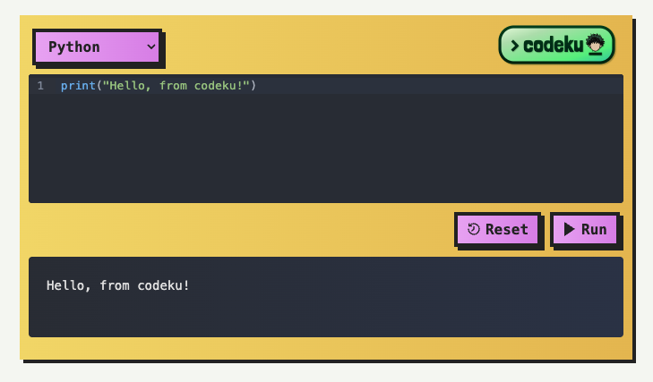

[](https://www.pcrf.net)

<p align="center">
  
</p>

<p align="center">
  <strong><i>codeku</i></strong> is a lightweight, plug-and-play, embeddable code execution widget for the web.
</p>

<div align="center">

[](https://github.com/alvii147/codeku/blob/main/LICENSE) [![PCRF](https://img.shields.io/badge/PCRF-0068A7?logo=data:image/png;base64,iVBORw0KGgoAAAANSUhEUgAAACAAAAAgCAMAAABEpIrGAAAAIGNIUk0AAHomAACAhAAA+gAAAIDoAAB1MAAA6mAAADqYAAAXcJy6UTwAAAKXUExURQAAAGBgYBERERYWFgUFBRUVFQ8PD1JSUicnJwkJCSMjIx0dHTY2NgICAjExMRoaGtsZPH8hMqIAFx8fH9sfQd0tTS8ABDAwMNxBXdcAHtgCKHFxcdoPNNkILhISEtoUOBgYGNgFKwYGBtgEK3CnSNoTNnmsVNkNMtkILXKoSnWqT9s+W9cAH9gBKG6mRWeiPKHCht0sTIR7OWmjP4e0Z3+wXdoYO61lTL0iKH6vWnutV3ytV4q2am6lRYKxX2ehPHKoS4CwXZ7EiHaqUHmsU5vCgDQ0NAoKCgYGBgMDAwICAgICAgEBAQMDAwQEBAsLCzc3Nzo6OggICAQEBAICAgAAAAwMDAQEBAEBAQYJCAMDAwICAggICHMKHQsCBAICAggICNsHLtACJ9kKL9gCKd0zUtgEKgUFBUBAQNkILdgBKAkJCd0zUdgEKgAAAAAAANkKMNgCKI+Pj7y8vNkGLNgAJ/Pz8/Hx8dgEK/Dw8NgDKfDw8NgCKfDw8NgBKPDw8PLx8vDw8LvSqtTgy22lRFubLdkHLW6lRXKoSt0vT2+mR4y3bdgCKW6mRnOpTNoFLdQIKm6mRXKoSqZXPHKfRHGnSXGqS3GoSnOpTW+mR26lRXOoTHGoSm+mR26lRW2lRG6mRW+mR4u2bIq2anKoS3CnSG+mR26mRm6mRW6lRXOoTIy3bAAAAGwAFAUAAdkAJ9MAJtgAJwYAAdEAJJIlOYR/gIaHh4aGhtwJL+h8j/Pu7/T19fT09NgAJtkGLOR4i+/q6/Dx8fDw8NkFLNgFK+R6jvDt7uR7jtoHLuZ5jvLs7vLy9PLx89UDJ7deULXJn7bQpbbPpNYEKKNTNXChRGylQ2ykQmykQ2+hQ2ymRG2lRKNTNv///6rKEb0AAACsdFJOUwAAAAAAAAAAAAAAAAAAAAAAAAAAAAAAAAAAAAAAAAAAAAAAAAAAAAAAAAAAAAAAAAAAAAAAAAAAAAAAAAAAAAAAAAAAAAACK2+w3PT+3LArAgI5muH8GozsN8TEN0Pb20M32xrFAoyMAjnsOQKamgIr4eAqb/z8bK+t3Nr08v79/GzgKpoCOes5AosCxMQaN9vbN0PbQzY3GozsGjmZ4fzhmgICK2+v3PT+KwK/OOV3AAAAAWJLR0TcB2CDtwAAAAlwSFlzAAAOwwAADsMBx2+oZAAAAAd0SU1FB+gEDhEoH+4tiKQAAAG1SURBVDjLY2AAAUYmZhY3dw9PL28fH29fPw//ABZWNnYGOOBg4AwMCg4JXQMFoSHBQQGcDFwweW4e3rDwiDUoICI8jJePHyIvICgUGbUGA0THMAiDVYiIisXGrcEC4hMYxIG2SEhKJSatXYdVRQwvgzSDjGxyyvoN2FVEhXHKMcinpm3ciEtFeoYCg2Jm1kacKiKylRhycjduhKjYhEVFXj5DQeFGiIrNW7Zu244OiooZSko3QsGOnbt270EDZeUMFTD5jXv37T9w8BAaqGSo2ohQcRhTRTVDzUa8KmoZ6jYiqzhy9Biqgnp0BccxFKBYsQ+LFVV45YGOJOhNeEDtPXHy1OkzaKChERHUZ8+dv3ARHTQ1M6RCI+vS5StXr6GD6y2tDMptWRD5GzdvYYD2DhUG1c40nPK3urrVGNQ1kns24pDv7dPUYtDW0e2fcBur/MRJevoGwGRvaDR5Clb5qcYmpqCMYWZuMa0Xi/nTjS2tIFnL2kZvxsxZqNKzZs62NbGCZU47e4fuOXPnzYfJzl+wsGORpr0jIns7OaupLF6ydNnyFStXrli+bOmq1SouWq5gKQBRdGzLoG9/PwAAACV0RVh0ZGF0ZTpjcmVhdGUAMjAyNC0wNC0xNFQxNzo0MDoyOSswMDowMG3aqdYAAAAldEVYdGRhdGU6bW9kaWZ5ADIwMjQtMDQtMTRUMTc6NDA6MjkrMDA6MDAchxFqAAAAKHRFWHRkYXRlOnRpbWVzdGFtcAAyMDI0LTA0LTE0VDE3OjQwOjMxKzAwOjAwtNd+TAAAABl0RVh0U29mdHdhcmUAd3d3Lmlua3NjYXBlLm9yZ5vuPBoAAAAASUVORK5CYII=&style=for-the-badge)](https://www.pcrf.net)

</div>

# Quick Start

To get started, embed the URL `https://alvii147.github.io/codeku/embed` in an `iframe`:

```html
<iframe
    src="https://alvii147.github.io/codeku/embed?language=python"
    width="100%"
    height="400"
    frameborder="0"
    allowfullscreen
>
</iframe>
```

The embedded widget will look like this:



# Languages

<strong><i>codeku</i></strong> currently supports the following languages:

<div align="center">

[](https://gcc.gnu.org/) [](https://gcc.gnu.org/) [](https://go.dev/) [](https://www.java.com/) [](https://nodejs.org/) [](https://www.python.org/) [](https://www.php.net/) [](https://www.rust-lang.org/) [](https://www.typescriptlang.org/)

</div>

# Parameters

You can customize <strong><i>codeku</i></strong> using the following query parameters:

Parameter | Description | Options | Example
--- | --- | --- | ---
`language` | Default programming language. | `c`, `cpp`, `go`, `java`, `javascript`, `python`, `php`, `rust`, `typescript` | `language=python`
`language_options` | Comma-separated list of programming languages to include in dropdown. | &nbsp; | `language=go,python,rust`
`code_{language}` | Initial code set for a language, url encoded. | &nbsp; | `code_python=print(42)`
